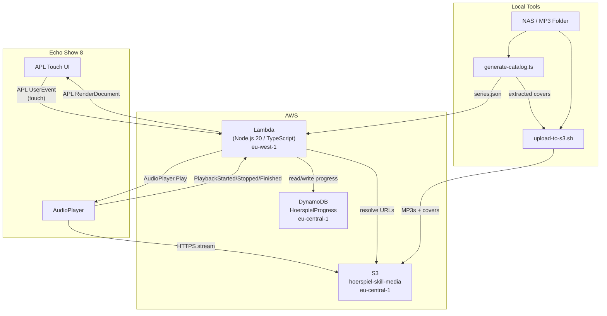
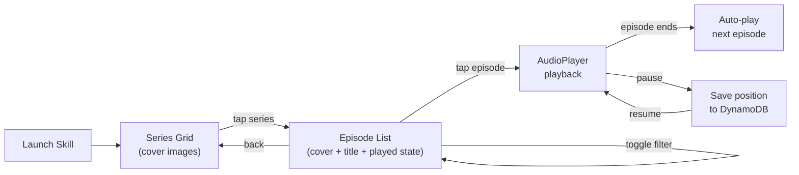

# Hoerspiel Player — Alexa Skill

Touch-first Alexa Skill for Echo Show 8. Browse Hoerspiel (audio drama) series, play MP3 episodes, track played/unplayed progress per user.

## Architecture



## User Flow



## Project Structure

```
alexa-skill/
├── skill-package/
│   ├── skill.json                         # Skill manifest (AudioPlayer + APL)
│   └── interactionModels/custom/
│       └── de-DE.json                     # German interaction model
│
├── lambda/
│   ├── package.json                       # Runtime dependencies (ASK SDK, AWS SDK)
│   ├── tsconfig.json                      # TypeScript config (Lambda)
│   └── src/
│       ├── index.ts                       # Handler registration
│       ├── types.ts                       # TypeScript interfaces
│       ├── handlers/
│       │   ├── LaunchHandler.ts           # Home screen — series grid
│       │   ├── SelectSeriesHandler.ts     # Episode list for a series
│       │   ├── PlayEpisodeHandler.ts      # Start/resume playback
│       │   ├── AudioPlayerHandlers.ts     # Playback lifecycle events
│       │   ├── PlaybackControlHandlers.ts # Pause / Resume / Next / Previous
│       │   ├── UserEventHandler.ts        # APL touch event routing
│       │   └── SessionEndedHandler.ts     # Cleanup
│       ├── apl/
│       │   ├── SeriesGridTemplate.json    # Cover image grid (home screen)
│       │   └── EpisodeListTemplate.json   # Episode list with cover + played state
│       ├── util/
│       │   ├── content.ts                 # Catalog queries + S3 URL resolution
│       │   ├── progress.ts               # DynamoDB CRUD (played/unplayed/offset)
│       │   └── apl.ts                     # APL support check + render helper
│       └── content/
│           └── series.json                # Episode catalog (generated)
│
├── infrastructure/
│   └── template.yaml                      # CloudFormation: S3 bucket + DynamoDB table
│
├── tools/
│   ├── generate-catalog.ts                # Scan MP3 folder → series.json + extract covers
│   └── upload-to-s3.sh                    # Sync MP3s + covers to S3
│
├── ask-resources.json                     # ASK CLI deployment config
├── package.json                           # Tools dependencies (music-metadata)
└── tsconfig.json                          # TypeScript config (tools)
```

## AWS Resources

| Resource | Type | Region | Purpose |
|----------|------|--------|---------|
| `ask-hrspielplayer-*` | Lambda | eu-west-1 | Skill backend (Alexa requirement) |
| `HoerspielProgress` | DynamoDB Table | eu-central-1 | User progress tracking |
| `hoerspiel-skill-media` | S3 Bucket | eu-central-1 | MP3 files + cover images |

### DynamoDB Schema

**Table: `HoerspielProgress`**

| Key | Attribute | Type |
|-----|-----------|------|
| PK | `userId` | String |
| SK | `episodeId` | String |
| | `seriesId` | String |
| | `status` | `"playing"` / `"played"` / `"unplayed"` |
| | `offsetMs` | Number |
| | `lastPlayed` | ISO timestamp |

**GSI: `SeriesIndex`** — PK: `userId`, SK: `seriesEpisodeKey` (`{seriesId}#{episodeId}`)

### Lambda Environment Variables

| Variable | Value |
|----------|-------|
| `S3_BASE_URL` | `https://hoerspiel-skill-media.s3.eu-central-1.amazonaws.com` |
| `DYNAMODB_TABLE` | `HoerspielProgress` |
| `DYNAMODB_REGION` | `eu-central-1` |

> `ask deploy` overwrites Lambda env vars. Re-run the `aws lambda update-function-configuration` command after each deploy.

## Setup

### Prerequisites

- Node.js 20+
- AWS CLI configured
- ASK CLI (`npm install -g ask-cli`)

### Infrastructure (once)

```bash
aws cloudformation deploy \
  --template-file infrastructure/template.yaml \
  --stack-name hoerspiel-skill \
  --region eu-central-1
```

### Generate Catalog from MP3 Folder

Expected folder structure:
```
/path/to/hoerspiele/
  TKKG/
    TKKG - Folge 001 - Die Jagd nach den Millionendieben.mp3
    TKKG - Folge 002 - Der blinde Hellseher.mp3
  Die drei Fragezeichen/
    001 - und der Super-Papagei.mp3
```

```bash
npm install                    # Install tools dependencies
npx ts-node tools/generate-catalog.ts /path/to/hoerspiele
```

This generates `lambda/src/content/series.json` and extracts episode cover art from MP3 ID3 tags into `extracted-covers/`.

### Upload to S3

```bash
# Upload MP3s
S3_BUCKET=hoerspiel-skill-media tools/upload-to-s3.sh /path/to/hoerspiele

# Upload extracted covers
aws s3 sync extracted-covers/ s3://hoerspiel-skill-media/covers/
```

### Build & Deploy

```bash
cd lambda && npm run build && cd ..
ask deploy --ignore-hash

# Re-set environment variables (ask deploy overwrites them)
aws lambda update-function-configuration \
  --function-name <your-lambda-function-name> \
  --region eu-west-1 \
  --environment 'Variables={S3_BASE_URL=https://hoerspiel-skill-media.s3.eu-central-1.amazonaws.com,DYNAMODB_TABLE=HoerspielProgress,DYNAMODB_REGION=eu-central-1}'
```

## Interaction Model

Touch-first design — minimal voice intents:

| Intent | Trigger | Action |
|--------|---------|--------|
| `LaunchRequest` | "Alexa, oeffne Hoerspiel Player" | Show series grid |
| `SelectSeriesIntent` | "Spiele TKKG" | Show episode list |
| `AMAZON.PauseIntent` | "Alexa, Pause" | Stop + save position |
| `AMAZON.ResumeIntent` | "Alexa, weiter" | Resume from saved position |
| `AMAZON.NextIntent` | "Alexa, weiter" | Next episode |
| `AMAZON.PreviousIntent` | "Alexa, zurueck" | Previous episode |

### APL Touch Events

| Event | Source | Action |
|-------|--------|--------|
| `SelectSeries` | Series grid tap | Show episode list |
| `PlayEpisode` | Episode list tap | Start playback |
| `GoBack` | Back button | Return to series grid |
| `ToggleFilter` | Filter button | Toggle all/unplayed episodes |
